

   <h1 align="center">
      🏫Student Management Web🏫
   <h4 align="center">
      <h4>✨SERN PROJECT✨</h4>
               

                    
                    
                    
                

         

            <a href="#Overview">Overview</a>
            •
            <a href="#GetStarted">Get Started</a>
            •
            <a href="#Features">Features</a>
            •
            <a href="#Usage">Usage</a>
            •
            <a href="#Contributors">Contributors</a>
         

      </h4>
   </h3>
    

   <h1 align="left" id="Overview">Overview👋</h1>
   
   >The Student Management System project is a web-based application built using `Reactjs` for the front-end and `Nodejs` for the back-end. This system aims to provide a `comprehensive` solution for managing student information in schools, including personal records, academic performance, and extracurricular activities
   
   **`Video`**
   
   <h1 id="GetStarted">Get Started⚙️</h1>
   
   >Follow these steps to get the Student Management System project up and running on your device:
   **1. Clone the repository:**
      `Full source`
      
           git clone https://github.com/JakePham23/TamLongHoi-Ex-TKPM.git
      
   **2. Run the project with docker**
      
   `Terminal` (macos)
         
         docker compose up -d --build
       
      
   `Terminal` (Windows)

         docker-compose up -d --build

   `Access`

         http://localhost:8080/

   **3. Run the project with terminal or cmd**
      
   `Start backend`

         cd backend
         npm i
         npm start

   `Start frontend`
      
         cd ..
         cd frontend
         npm i
         npm run build

   `Access`

         http://localhost:5173/
   **4. Run the project with detailed API documentation**

   `Terminal`

         cd backend
         npm i
         npm run api

   `Access API documentation`

          http://localhost:4000/api-docs

# Features 🤖

   **1. Giao diện Sinh viên (Student view):**

- Giao diện bảng danh sách sinh viên
  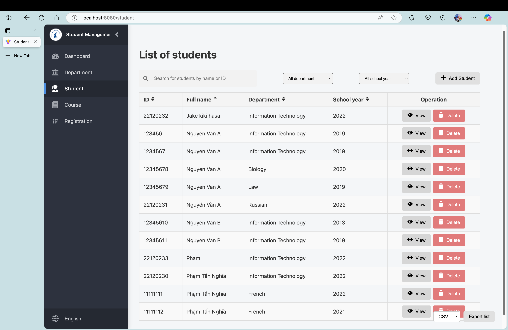
- Thông tin chi tiết sinh viên
  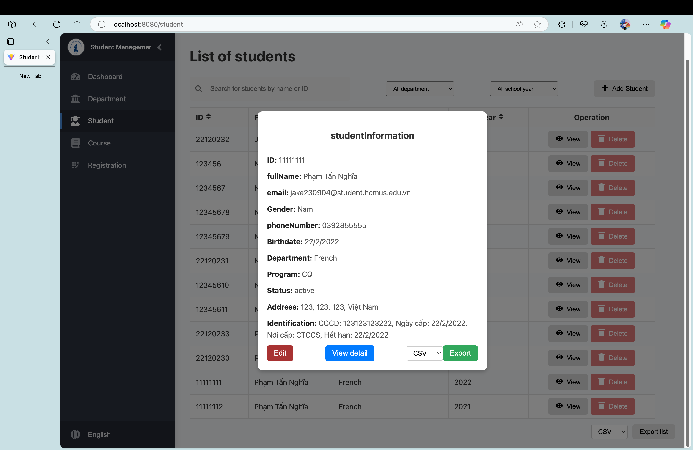
- Xem chi tiết một sinh viên
  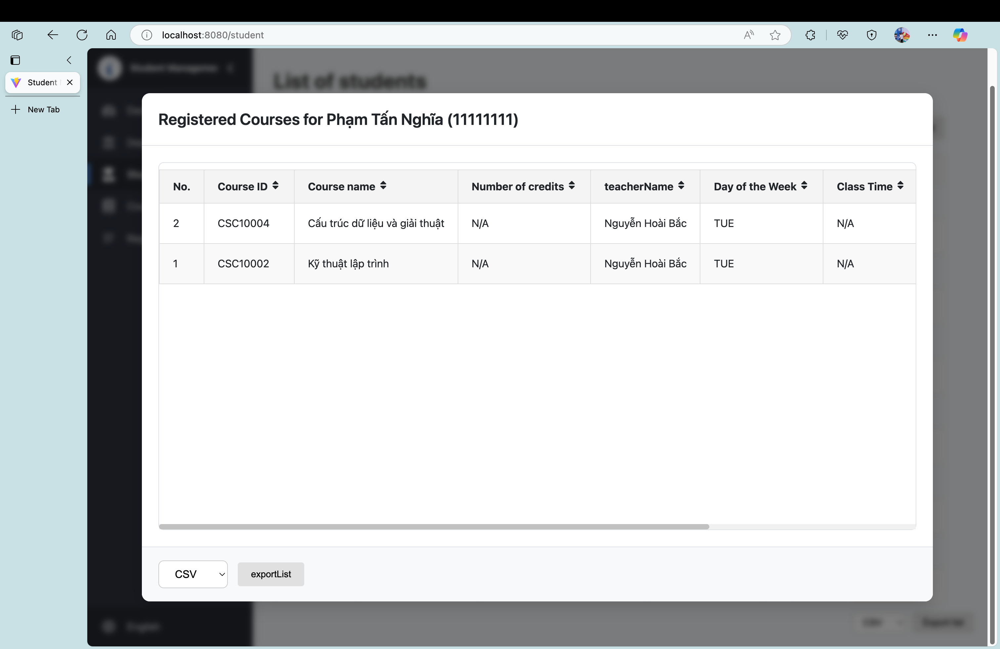
- Tạo mới sinh viên
  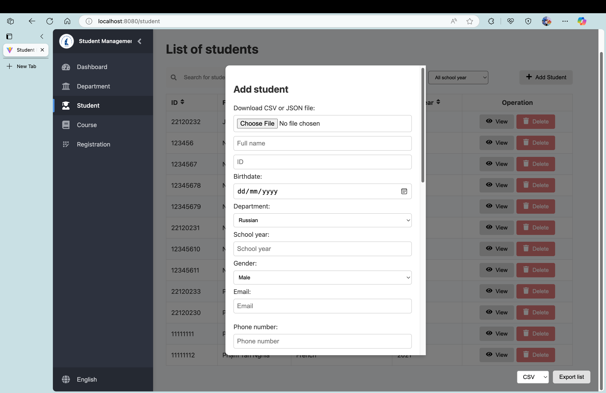

**2. Giao diện Khoa (Department view):**

- Tạo mới khoa
  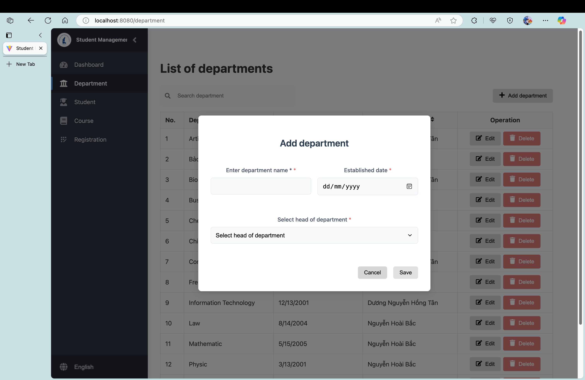
- Giao diện bảng danh sách khoa
  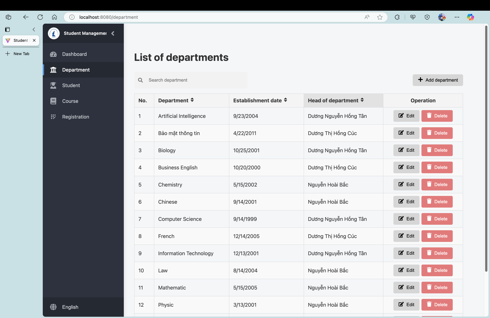
- Cập nhật thông tin khoa
  

**3. Giao diện Môn học (Course view):**

- Giao diện bảng danh sách môn học
  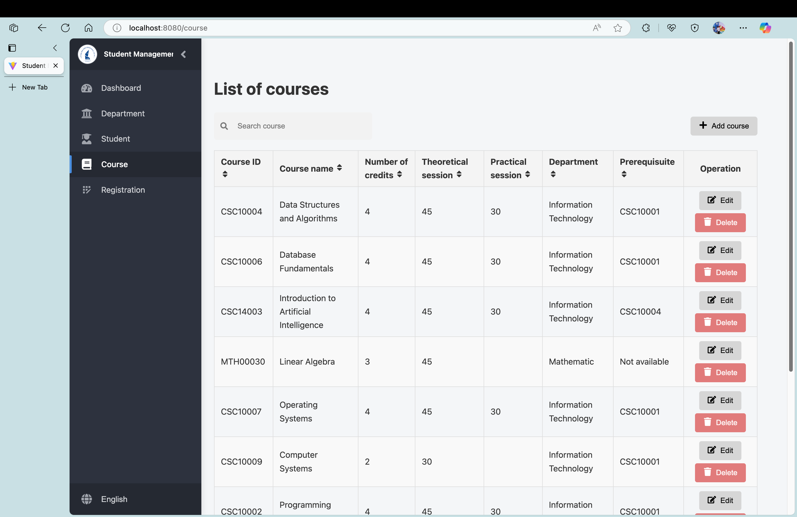
- Cập nhật thông tin môn học
  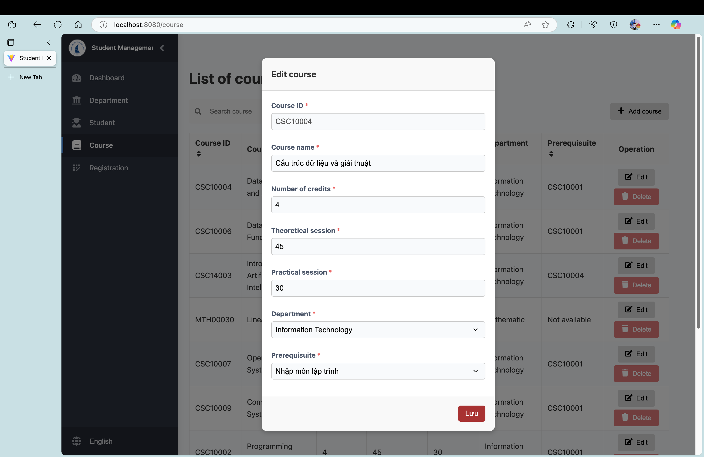
- Tạo mới môn học
  

**4. Giao diện Đăng ký môn học (Registration view):**

- Giao diện bảng danh sách đăng ký
  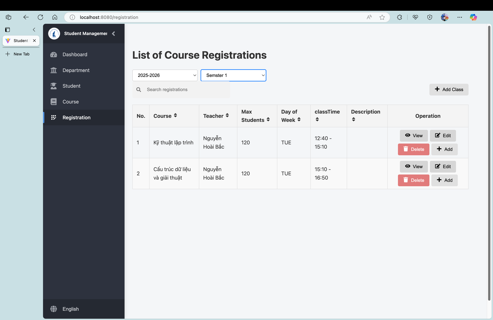
- Cập nhật đăng ký
  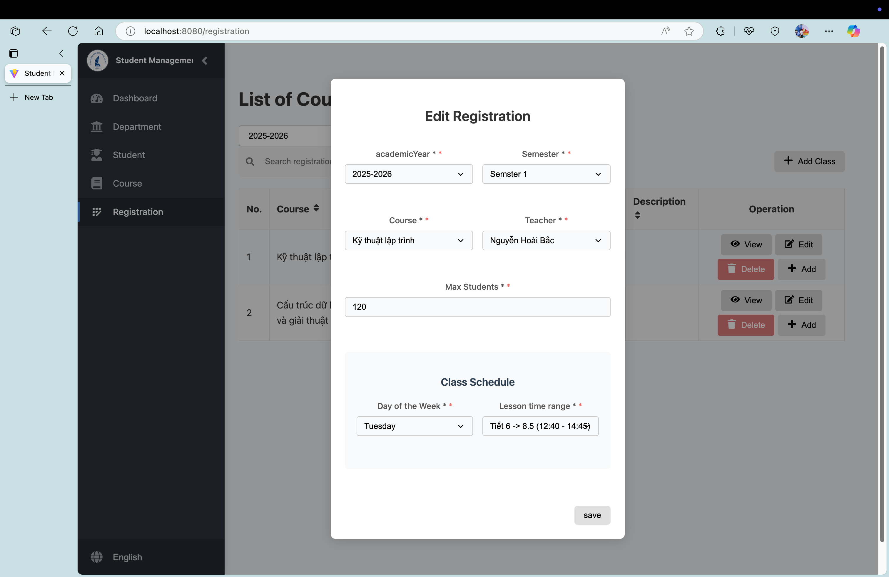
- Xem chi tiết đăng ký
  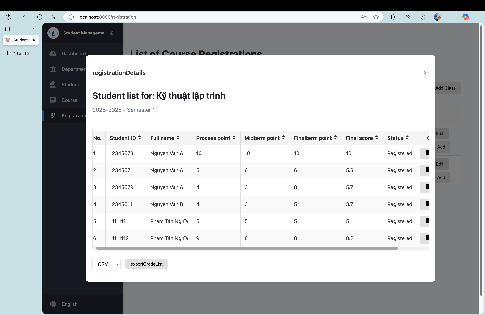
- Tạo mới lượt đăng ký
  
- Sinh viên đăng ký môn học
  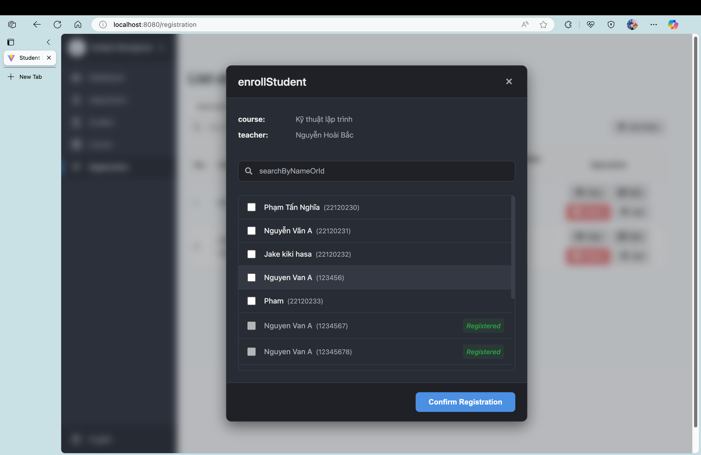

   

     

   <h1 id="Contributors">Contributors🤝</h1>

  

  

  

   
   ## 1. License
   This project is licensed under the MIT License.

