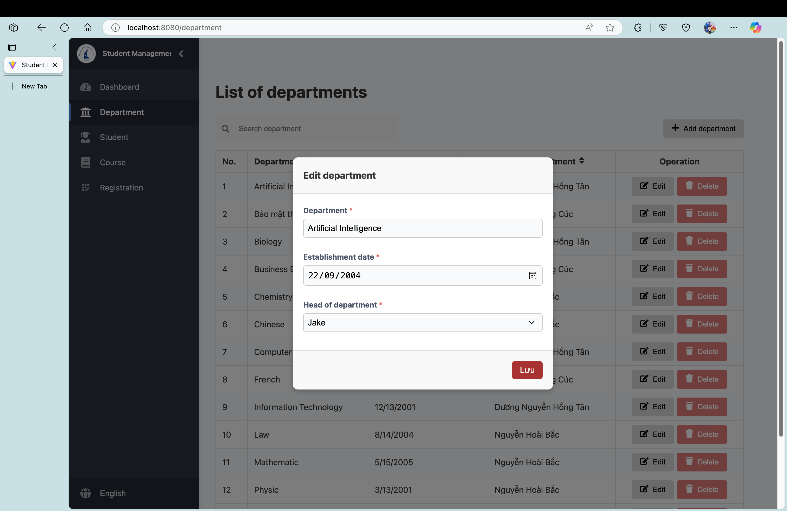

   <h1 align="center">
      🏫Student Management Web🏫
   <h4 align="center">
      <h4>✨SERN PROJECT✨</h4>
               

                    
                    
                    
                

         

            <a href="#Overview">Overview</a>
            •
            <a href="#GetStarted">Get Started</a>
            •
            <a href="#Features">Features</a>
            •
            <a href="#Usage">Usage</a>
            •
            <a href="#Contributors">Contributors</a>
         

      </h4>
   </h3>
    

   <h1 align="left" id="Overview">Overview👋</h1>
   
   >The Student Management System project is a web-based application built using `Reactjs` for the front-end and `Nodejs` for the back-end. This system aims to provide a `comprehensive` solution for managing student information in schools, including personal records, academic performance, and extracurricular activities
   
   **`Video`**
   
   <h1 id="GetStarted">Get Started⚙️</h1>
   
   >Follow these steps to get the Student Management System project up and running on your device:
   1. Clone the repository:

      `Full source`
      
           git clone https://github.com/JakePham23/TamLongHoi-Ex-TKPM.git
      
   2. Run the project with docker 

      `Terminal` (macos)
         
            docker compose up -d --build

       `Terminal` (Windows)

            docker-compose up -d --build

   3. Run the project with terminal or cmd 

      `Start backend`

            cd backend
            npm i
            npm start

      `Start frontend`
      
            cd ..
            cd frontend
            npm i
            npm run build

      <h1 id="Features">Features🤖</h1>

   4. Student view:

      

      
      
      
      
      

   5. Department view:
   
      
      
      

      

   6. Course view:

      

      
      
      

   7. Registration view

      

      
      
      
      
      

      

   

     

   <h1 id="Contributors">Contributors🤝</h1>

  

  

  

   
   ## 1. License
   This project is licensed under the MIT License.

